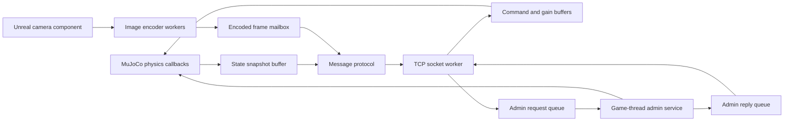

# Runtime boundaries

The simulator has independent physics, camera, protocol, and transport responsibilities.
The existing TCP ports and outer framing are retained. AV1 uses codec ID 3 and requires the updated Python client.



## Physics and channel handles

`UURSRobotCoreComponent::GetRobotChannels()` copies static metadata and shared buffer
handles under the endpoint lock. The transport cannot access core internals, Unreal
camera objects, or MuJoCo model/data through these handles.

Each state triple buffer has exactly one consumer: the active network service. Unreal
reads a separate game-state buffer. Command/gain publication supports serialized writers;
physics consumes the latest complete update. Partial gain messages are merged before
publication so fields do not disappear between physics steps.

## Camera capture and encoding

`UURSCameraStreamComponent` schedules camera readback on the game thread and supports
both nDisplay atlas readback and direct robot camera readback. It contains no socket or
wire-protocol code. Capture rate is independent of the state publication rate.

A consumer binds `OnEncodedFrame` and enables `SetCaptureDemand(true)`. The TCP coordinator
uses subscriber demand reported by the network service. With no robot subscribers it
does not request camera readback or encoding; nDisplay's normal rendering can continue.
A local consumer can use the same component without a network listener.

`FImageEncoder` accepts owned pixels and produces raw BGRA8 or JPEG image data.
`FAv1Encoder` owns a persistent FFmpeg Vulkan AV1 codec per robot/guest. Stereo
eyes are packed side by side before encoding and split by the Python decoder.
`FVideoDeliveryGate` handles each connection independently: sequence gaps or
unsent packet replacement skip dependent video until a periodic keyframe.
No connection or recovery event requests a keyframe. Lossless depth remains
a separate independently scheduled message. See [AV1 runtime](AV1_Runtime.md). There is
at most one encoding job per robot per scene generation. Jobs use a shared completion
mailbox, never a UObject. Old-generation completions are discarded after a scene rebuild;
shutdown waits for outstanding jobs before releasing the encoder module. Black frames remain valid image input.

The component emits `FEncodedCameraFrame` with actor ID, sequence, simulation time, and
image metadata. Actor ID is a routing key rather than a position in the robot array.
Currently the simulation timestamp is sampled when the camera frame is consumed, as in
the previous implementation; it is not a guarantee of exact exposure/state synchronization.

The coordinator waits for the camera layout to stabilize before opening TCP listeners.
This avoids opening and immediately replacing connections during nDisplay's startup
metadata refresh. The socket adapter itself has no nDisplay dependency.

## Protocol and transport

`FMessageProtocol` handles state JSON serialization, robot command decoding, and v2 image
payload serialization. Decoding produces typed messages and has no socket/buffer side
effects. JSON helpers live in `Protocol/`. Image compression belongs to `Vision/`; future
state/message compression belongs with the application protocol and must be explicitly
identified on the wire. TCP sends the encoded payload without recompressing it.

`IURSNetworkService` is the game-thread-facing adapter contract. `URSNetworkThread` is its
TCP implementation. It owns listener creation, accept/read/write, and socket destruction
on its worker thread. It also owns TCP framing, client identity, write buffering, and
backpressure. There are no UObject, rendering, or MuJoCo calls in the worker.

State messages and camera frames are scheduled separately. The camera handoff stores
only the latest unsent frame for each known actor and one pending video frame per client.
A newer frame replaces that pending frame while an earlier frame finishes sending.
Once bytes enter a TCP client's write buffer, they are not replaced: discarding a partially sent frame would corrupt the stream.
A client whose unsent buffer exceeds 4 MiB is disconnected. Receive buffers, receive work,
frame parsing work, and pending admin requests are bounded.

Admin requests cross an ordered queue with a stable connection ID. The coordinator runs
`FAdminService::Execute()` on the game thread; the service parses the request and invokes
core operations. Replies return through a queue to the owning connection. Disconnected
clients cannot receive another client's reply. Scene rebuilds replace the network service
and cancel its pending requests/connections; clients reconnect as before.

A UDP implementation can implement `IURSNetworkService` and reuse the channel handles,
encoded frames, and message protocol. It will still need datagram sequencing, loss handling,
and image fragmentation/reassembly. Administrative operations may retain a reliable TCP
path. UDP is not implemented. Guest inspector sessions now use a separate adapter and
floating camera component, sharing the image encoder and v2 RGB serializer.

The guest camera endpoint and Python receiver are described in
[Guest_Cameras.md](Guest_Cameras.md). Inspector sockets run on their own worker;
Unreal capture uses asynchronous GPU readback and the shared encoder pool.

## Verification

Build the editor normally. Run the `URSoccerLab.` automation suite, including
`URSoccerLab.NetworkIsolation` for standalone encoding/wire compatibility and real socket
worker/mailbox checks. Run the source integration test:

```sh
py_example/.venv/bin/python Tools/runtime/test_network_refactor.py
```

It checks JPEG and raw stereo streams, two robot ports, multiple clients, applied commands,
admin operations, fragmented and malformed admin frames, and reconnects. Logs, images,
and results are written to `artifacts/tests/network-refactor-runtime/`. It never cooks or
updates the AppImage.
